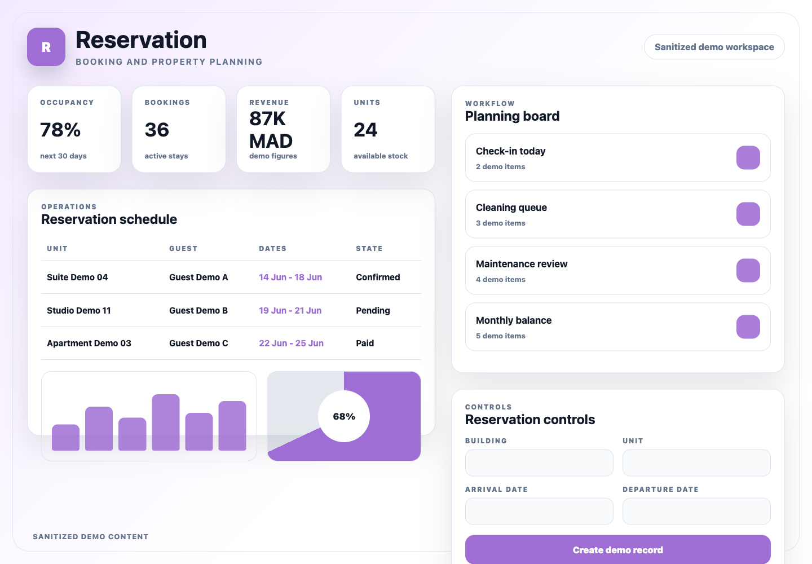
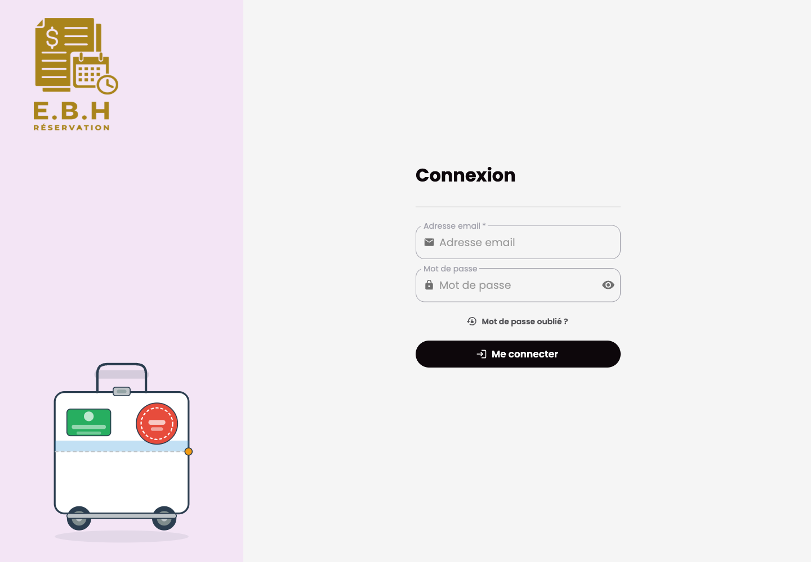

# Reservation Backend

## Purpose

Reservation Backend is the Django API for property and booking operations. It manages buildings, units, reservations, financial movements, dashboard metrics, user access, notifications, and websocket events.

## Stack

- Python and Django
- Django REST Framework
- Simple JWT and dj-rest-auth
- django-filter
- Channels, Daphne, Redis, and Celery
- PostgreSQL
- Pytest and pytest-django

## Features

- Building and unit management
- Reservation planning and availability APIs
- Cost, gain, balance, and occupancy data
- User, role, and permission management
- Notification and maintenance endpoints
- Real-time websocket integration

## Setup

Provide local-only variables for Django runtime settings, database, Redis, media storage, and allowed origins. Use localhost values for local development and do not commit local configuration files.

```bash
python -m venv .venv
source .venv/bin/activate
pip install -r requirements.txt
python manage.py migrate
python manage.py runserver 8002
```

## Tests

```bash
python -m pytest
```

## Screenshots

Sanitized product workspace:



Authentication screen:


