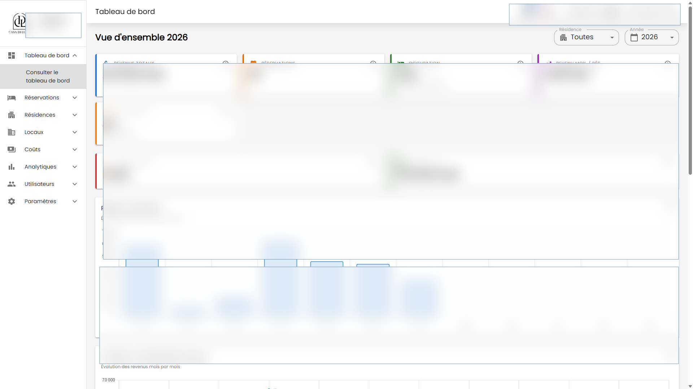

# Reservation Backend

Django REST API for a reservation and property operations platform for buildings, local units, reservations, planning, occupancy, costs, gains, balances, Hilton reports, users, notifications, and maintenance controls.

This is a production-oriented business backend. It models real operational workflows, authenticated staff access, API filtering, document/report generation, realtime notification plumbing, and testable domain behavior.

## What It Shows

- Backend ownership for a complete internal business application.
- Django REST API design across related business modules.
- PostgreSQL data modeling for operational records and audit/history needs.
- Auth, permissions, SSO subject handling, filters, dashboards, exports, and realtime events.
- Testable backend code with pytest tooling instead of only manual checks.

## Main Modules

- account
- building
- local
- reservation
- core
- notification
- ws

## Key Capabilities

- Django REST API for buildings, rentable units, reservations, costs, gains, balances, occupancy, reporting, and users.
- Availability and planning endpoints that support calendar-style reservation operations.
- Permission-aware user access with JWT/session auth, SSO subject support, django-filter, and django-axes protection.
- Dashboard and reporting data for occupancy, balance, costs, gains, local status, and booking views.
- Realtime notifications and websocket events through Channels, Daphne, Redis, and Celery-ready runtime pieces.
- pytest/pytest-django test stack with async/cov/xdist support.

## Stack

- Python, Django 6, Django REST Framework
- PostgreSQL, django-filter, django-simple-history
- SimpleJWT, dj-rest-auth, django-axes, CORS
- Redis, Channels, channels-redis, Daphne, Celery-ready runtime
- Gunicorn, WhiteNoise, Pillow/OpenCV where media handling is needed
- pytest, pytest-django, pytest-cov, pytest-asyncio, pytest-xdist

## Related Repository

- Frontend: [Altroo/reservation_frontend](https://github.com/Altroo/reservation_frontend)

## Product Screenshots

Redacted production UI screens powered by this API. Sensitive names, amounts, dates, and records are blurred.




## Local Setup

Create local-only environment variables for Django settings, database, Redis, media/static storage, CORS, and allowed hosts. Do not commit `.env` files or production credentials.

```bash
python -m venv .venv
source .venv/bin/activate
pip install -r requirements.txt
python manage.py migrate
python manage.py runserver 8002
```

On Windows, activate with `.venv\Scripts\activate`.

## Tests

```bash
python -m pytest
python -m pytest --cov
```

## Portfolio Note

The repository is public for portfolio review. Screenshots are redacted, and sensitive production values are intentionally hidden.
